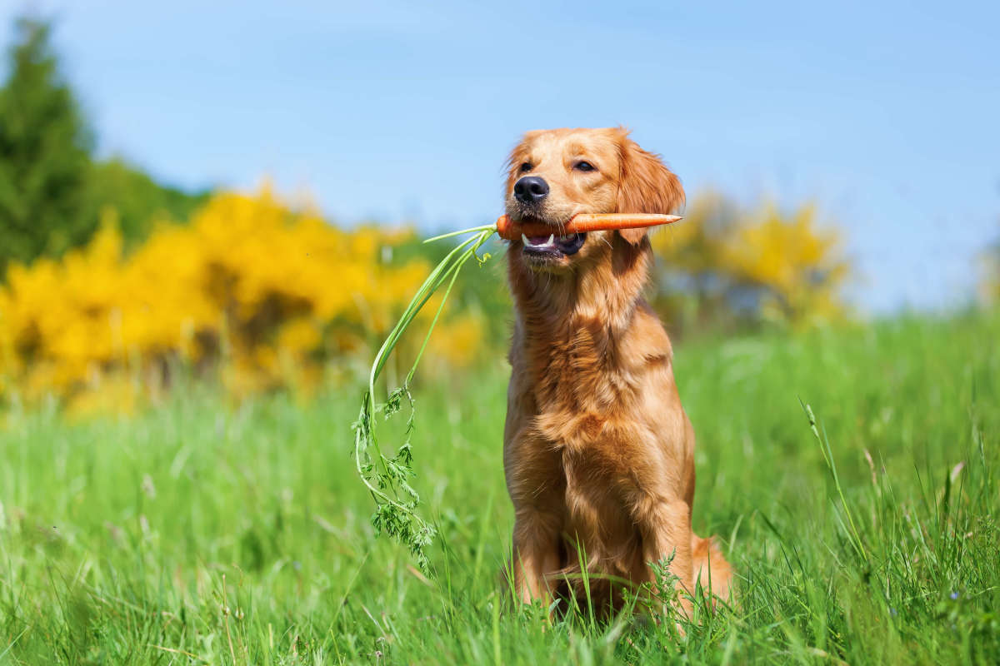

#collaborate

### Vegan Dog Food

Luckily, there are quite a lot of vegan-friendly foods that are safe for my little Nola to enjoy on a vegan diet

**Some of these foods include:** 

   - Dark, leafy greens (*such as spinach*)

    - Lentils

    - Rice

    - Broccoli

    - Carrots

    - Quinoa

    Certain types of beans (note: beans can cause flatulence in dogs- use beans sparingly)

    
    
    
 ##   NOLA’S FAVORITE RECIPE

### Ingredients:                                                                                                          
- 6 cups of filtered water
- 3 ¾ cups of organic Indian basmati (white) rice
- ½ cup of organic red quinoa
- 16 oz. package of frozen organic mixed vegetables
- ¾ cup of nutritional yeast
- ½ cup ground flax seed
- ¾ cup of olive oil or sunflower oil
- 20 ounce package of organic firm tofu, crumbled
- 15 ounce can of organic black beans, drained
- 15 ounce can of organic garbanzo beans, drained
- 1 teaspoon salt
- 2 ½ tablespoons Vegedog supplement

### Directions:

In a large soup pot bring water to a boil. Add rice and quinoa. Cover, reduce heat to low and cook until rice and quinoa are done (approximately 15 minutes). Turn off heat. Add frozen vegetables to the pot and cover again to let them steam a little bit. Let rest for ten minutes. Add additional ingredients and mix.

## Pak Choi with Ginger and Seitan

-  quite some Pak Choi
-  a thumb of Ginger
-  enough Seitan
-  Coconut oil
-  Ginger oil
-  a little Garlic
-  a few dashes of soy sauce

-  a wok with a lid

1.  Wash and cut everything to size and comfortable degree of cleanliness.
2.  Fry the garlic and ginger and seitan a little bit before adding the pak choi to the wok. It's cool if there is still a little water on the leaves so that it steams up nicely. Add a little bit of soy sauce just to cut the frying oil down. Maybe also a little bit of ginger oil. 
3. put the lid on and let cook for a couple minutes until the pak choi is done.

